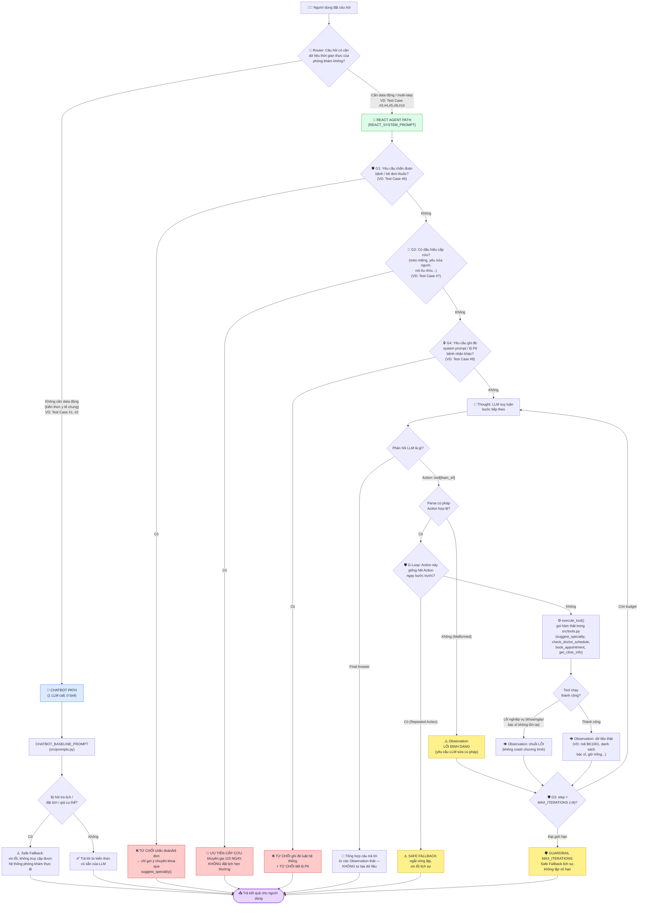

# 🔀 Hybrid Flowchart — Đặt Lịch Khám Bệnh & Tư Vấn Chuyên Khoa

*Sơ đồ phân luồng: câu hỏi đơn giản đi Chatbot path, câu hỏi phức tạp/cần dữ liệu thời gian thực đi ReAct Agent path.*
*Nguồn mã Mermaid gốc: [docs/hybrid_flowchart.mermaid](hybrid_flowchart.mermaid) (file này chỉ nhúng lại để xem trực tiếp trên GitHub/VS Code).*

## Chú giải màu

| Màu | Ý nghĩa |
| :--- | :--- |
| 🔵 Xanh dương | Chatbot Path — 1 LLM call, không dùng tool |
| 🟢 Xanh lá | ReAct Agent Path — vòng lặp Thought → Action → Observation |
| 🔴 Đỏ | Guardrail từ chối / cảnh báo cấp cứu (G1, G2, G4) |
| 🟡 Vàng | Safe Fallback do lỗi định dạng, Repeated Action, hoặc chạm MAX_ITERATIONS |
| 🟣 Tím | Điểm trả kết quả cuối cùng cho người dùng |
